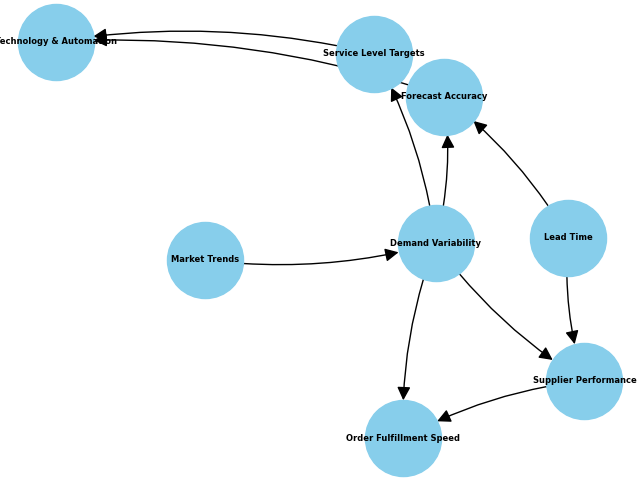
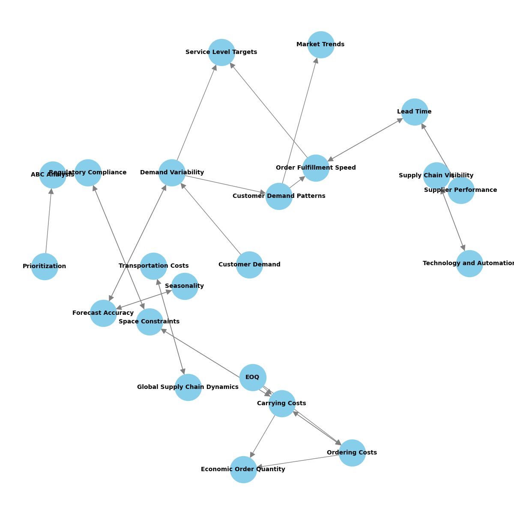
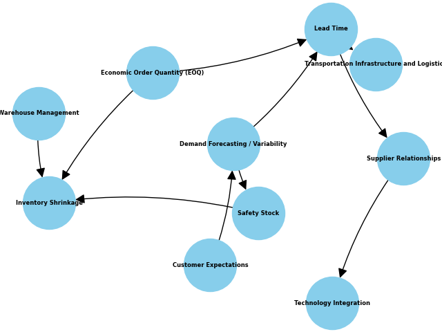
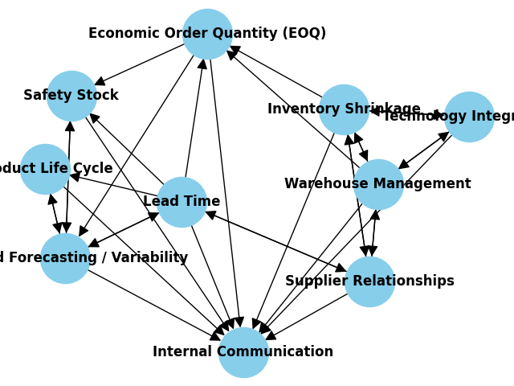

## Process
- Inorder to get the model to generate a bayesian network, I decided to
  ask it a set of questions.
- Using these questions, I ask the models to give us the bayesian network
  in python, which can later be tested on our respective PCs.
- Finally, I analyse these answers and verify if they are accurate and similar.

## Structure
- The questions can be found in the [Questions.md](Questions.md) file
- The folders contain the answers provided by every model along with the python codes used to generate the network images.

## Results
 Detailed results can be found in the [Results.md](Results.md) file

### GPT-3.5 Bayesian Network

### GPT-3.5 Dependency Graph

### BARD Bayesian Network

### BARD Dependency Graph
